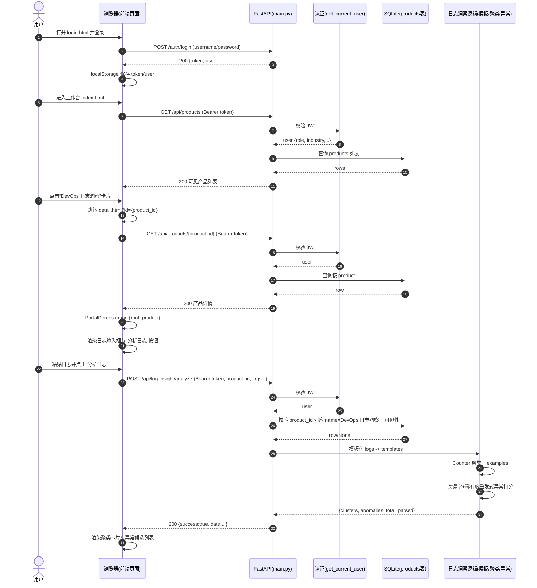

# DevOps 日志洞察：功能时序图

> 说明：该模块前端交互在 `detail.html` 里通过 `portal-demos.js` 的 `PortalDemos.mount()` 挂载，点击“分析日志”会调用后端 `POST /api/log-insight/analyze`。

```mermaid
sequenceDiagram
  autonumber
  actor U as 用户
  participant B as 浏览器(前端页面)
  participant API as FastAPI(main.py)
  participant Auth as 认证(get_current_user)
  participant DB as SQLite(products表)
  participant LI as 日志洞察逻辑(模板/聚类/异常)

  U->>B: 打开 login.html 并登录
  B->>API: POST /auth/login (username/password)
  API-->>B: 200 {token, user}
  B->>B: localStorage 保存 token/user

  U->>B: 进入工作台 index.html
  B->>API: GET /api/products (Bearer token)
  API->>Auth: 校验 JWT
  Auth-->>API: user {role, industry,...}
  API->>DB: 查询 products 列表
  DB-->>API: rows
  API-->>B: 200 可见产品列表

  U->>B: 点击“DevOps 日志洞察”卡片
  B->>B: 跳转 detail.html?id={product_id}
  B->>API: GET /api/products/{product_id} (Bearer token)
  API->>Auth: 校验 JWT
  Auth-->>API: user
  API->>DB: 查询该 product
  DB-->>API: row
  API-->>B: 200 产品详情

  B->>B: PortalDemos.mount(root, product)
  B->>B: 渲染日志输入框与“分析日志”按钮

  U->>B: 粘贴日志并点击“分析日志”
  B->>API: POST /api/log-insight/analyze (Bearer token, product_id, logs...)
  API->>Auth: 校验 JWT
  Auth-->>API: user
  API->>DB: 校验 product_id 对应 name=DevOps 日志洞察 + 可见性
  DB-->>API: row/None
  API->>LI: 模板化 logs -> templates
  LI->>LI: Counter 聚类 + examples
  LI->>LI: 关键字+稀有度启发式异常打分
  LI-->>API: {clusters, anomalies, total, parsed}
  API-->>B: 200 {success:true, data:...}
  B->>B: 渲染聚类卡片与异常候选列表
```

